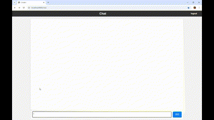
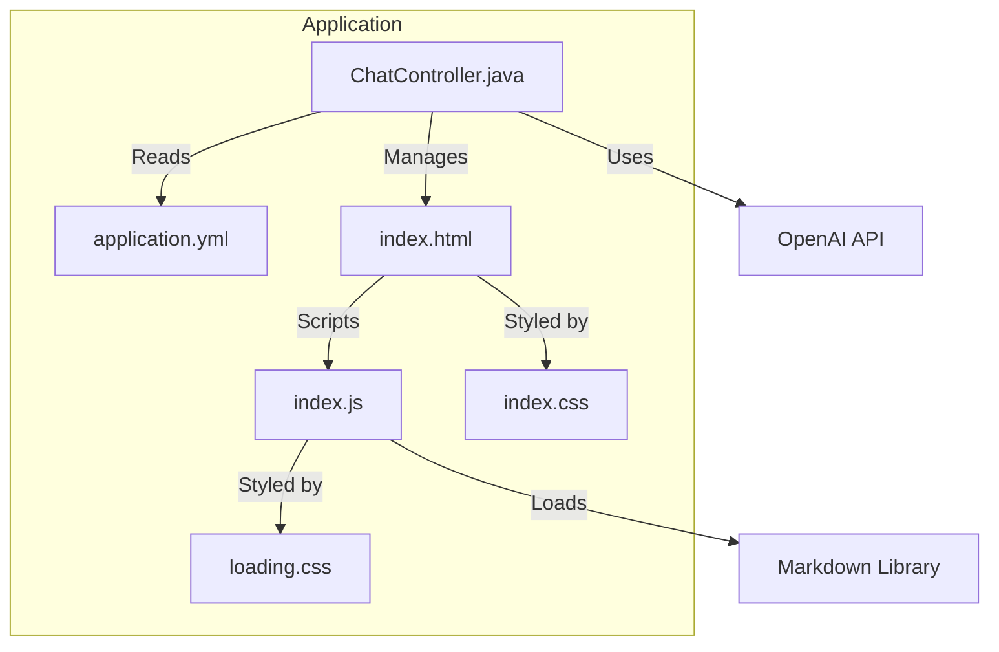

# OpenAI-Chat-Starter
このアプリケーションは、Spring BootとSpring AIを活用して作られたチャットボットです。<br>
ユーザーがメッセージを送信すると、サーバーがOpenAIのAPIを利用して返信を生成し、それをチャット画面に表示します。

## 使用技術
- Spring (Boot,Web,AI,Security)
- OpenAI API
- Thymeleaf
- JavaScript (Fetch API, Markdown)
- CSS

## 機能
- ユーザーがメッセージを送信し、チャットに表示
- サーバーからの返信を表示し、返信を待っている間ローディングアニメーションを提供
- サーバーからのMarkdown形式の回答をHTMLに変換して表示
- チャットエリアが自動的にスクロールし、最新のメッセージが表示される

### デモ

    

## コンポーネント図


## 必要要件
- Java 17以上
- OpenAI API: APIキーを取得して設定する必要があります。

## 使い方
1. リポジトリをクローンする:
    ```bash
    $ git clone https://github.com/yoshikawa260/OpenAIChatApp-Starter.git
    ```
2. `application.yml`の変数に値をセットする。
    ```yaml
    spring:
      security:
        user:
          name: ${USER}  # 環境変数 USER を設定してください
          password: ${PASSWORD}  # 環境変数 PASSWORD を設定してください
      ai:
        openai:
          api-key: ${OPENAI_API_KEY}  # OpenAI API の api-key を設定してください
          chat:
            options:
              model: ${MODEL}  # 使用するモデルを設定してください。例：gpt-4o-mini
              temperature: 0.2
              max-tokens: 1000
    ```
    変数は、環境変数として設定するか、`application.yml`ファイルに直接値を入力してください。

3. アプリケーションを起動し、[http://localhost:8080/chat](http://localhost:8080/chat) にアクセスしてください。


## その他
このアプリケーションは、学習目的で作成されたものです。<br>
使用や改変は自由ですが、商用利用には注意が必要です。
